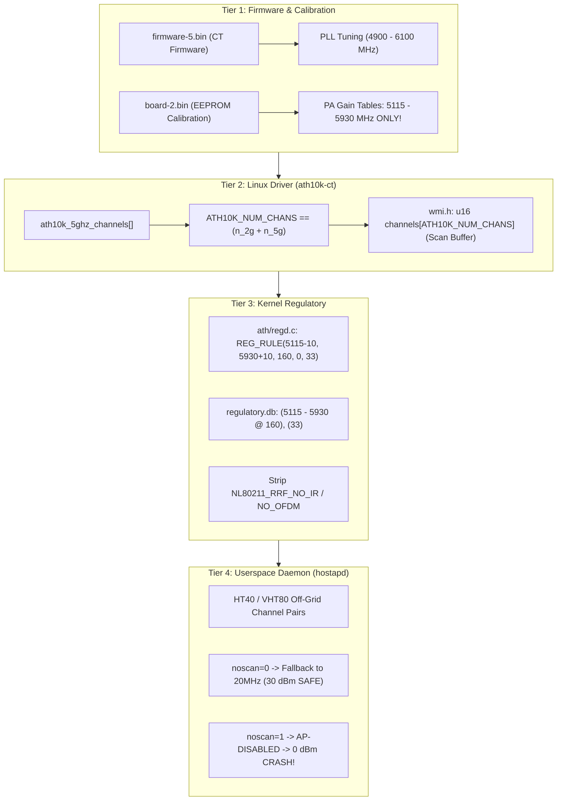

# 🗺️ خارطة طريق توسعة الترددات (5MHz Resolution) وتفادي فخ هبوط الباور (0 dBm)
## 5 GHz Spectrum Expansion Roadmap (5 MHz Step) & Zero-Power Trap Prevention Architecture

---

## 1. الخلفية الهندسية: تشريح فخ هبوط الباور إلى صفر (Anatomy of the 0 dBm Trap)

أثبتت تجارب التطوير والتحليل العميق لمعمارية كوالكوم **IPQ4019 (QCA4019)** أن انخفاض قدرة البث (Tx-Power) إلى **0 dBm** أو موت إشارة الوايرلس ليس عطلاً عشوائياً، بل هو نتيجة مباشرة لسقوط أحد **مستويات التحقق الأربعة (4 Tiers)**.



---

## 2. الأسباب التاريخية الدقيقة لمشكلة 0 dBm وكيف عولجت (How 0 dBm Was Conquered)

### السبب 1: فخ مجلدات الحزم المنفصلة في أوبن ويرت (OpenWrt Package Variants)
* **المشكلة**: عند تعديل ملفات `ath10k-ct` داخل `build_dir` مباشرة بواسطة السكربت `07-unlock-superchannel.sh`، يقوم نظام OpenWrt ببناء حزمة `kmod-ath10k-ct-smallbuffers` (وهي الحزمة التي يتم شحنها في الروم) داخل مجلد بناء منفصل تماماً، فيتم تجاهل التعديل ويبقى الدرايفر بـ 27 قناة فقط بينما واجهة LuCI تعرض 68 قناة! عند اختيار قناة إضافية (مثل 146)، يفشل hostapd في بدء البث ويهبط الباور إلى 0 dBm.
* **الحل**: تم إنشاء سكربت `scripts/gen_package_patches.py` الذي يقوم بتوليد باتش حقيقي `999-horus-superchannels.patch` داخل مجلد الباتشات الرسمي للدرايفر، ليتم تطبيقه على جميع الـ Variants تلقائياً أثناء فك الحزمة.

### السبب 2: قفل التجميع وحجم بفر المسح في الدرايفر (`ATH10K_NUM_CHANS` & `wmi.h`)
* **المشكلة**: 
  1. يقوم الدرايفر بفحص إجباري أثناء التجميع:
     ```c
     BUILD_BUG_ON((ARRAY_SIZE(ath10k_2ghz_channels) + ARRAY_SIZE(ath10k_5ghz_channels)) != ATH10K_NUM_CHANS);
     ```
     أي رقم لا يطابق مجموع القنوات الفعلي يتسبب في فشل التجميع فوراً.
  2. في `wmi.h`، كان حجم مصفوفة المسح ثابتاً عند 64 قناة: `u16 channels[64];`. عند مسح نطاق 5GHz الممتد (أكثر من 64 قناة)، يفيض البفر على الذاكرة وتفشل وظيفة المسح بالخطأ `-EINVAL (-22)`، مما يمنع الجهاز من الربط كعميل (Client).
* **الحل**: يقوم `gen_package_patches.py` بحساب عدد القنوات بدقة ديناميكية وتوسيع `channels[ATH10K_NUM_CHANS]` تلقائياً.

### السبب 3: حدود معايرة الباور في الفلاشة (`board-2.bin`) وحدود `regd.c`
* **المشكلة**: رقاقة QCA4019 تحتوي على جداول تضخيم الباور (Power Amplifier Calibration) في ملف `board-2.bin` تغطي فقط النطاق من **5115 MHz إلى 5930 MHz**. أي تردد يتم طلبه خارج هذا النطاق إما أن يرفضه الكيرنل في `ath/regd.c` بقاعدة `NO_IR` فيهبط الباور إلى 0 dBm، أو يعمل بدون معايرة فيحدث تشويش وضعف إشارة شديد.
* **الحل**: تثبيت قواعد التنظيم `regulatory.db` و `ath/regd.c` على المدى الآمن والمطابق لـ EEPROM وهو: `(5115 - 5930 @ 160), (33)`.

### السبب 4: فخ دمج القنوات وعرض النطاق في القنوات غير القياسية (`noscan` Trap)
* **المشكلة**: القنوات غير القياسية (Off-Grid Channels مثل 80 أو 146) لا تمتلك أزواج قنوات ثانوية قياسية لعمل HT40 أو VHT80. عندما يطلب النظام تشغيل VHT80، يحاول `hostapd` البحث عن التردد الثانوي فيفشل ويطلب الهبوط إلى 20MHz (`Fallback to 20 MHz`). إذا كان خيار `noscan '1'` مفعلاً، يتم منع الهبوط فيتوقف `hostapd` تماماً ويعطي `AP-DISABLED`، فيهبط الباور إلى 0 dBm!
* **الحل**: جعل `noscan '0'` تلقائياً على القنوات غير القياسية، مما يسمح لـ `hostapd` بالهبوط الآمن إلى 20MHz والبقاء في حالة `AP-ENABLED` مع باور كامل **30 dBm (1000 mW)**.

---

## 3. خارطة الطريق لتوسعة الترددات إلى دقة 5 MHz (The 5 MHz Expansion Plan)

### المدى الآمن الفائق والموسع (Expanded SuperChannel Plan: 5120 - 6000 MHz):
* **أدنى تردد**: `5120 MHz` (يقابل القناة 24).
* **أعلى تردد**: `6000 MHz` (يقابل القناة 200).
* **خطوة التردد**: **5 MHz** منتظمة ومستمرة.
* **المعادلة الحسابية للتردد**:
  $$\text{Frequency (MHz)} = 5000 + (5 \times \text{Channel})$$
* **إجمالي القنوات**:
  $$\text{Total Channels} = \frac{6000 - 5120}{5} + 1 = 177 \text{ قناة}$$

```text
قنوات النطاق الكامل (177 قناة):
24, 25, 26, 27, 28, 29, 30, 31, 32, 33, 34, 35, 36, 37, 38, 39, 40,
41, 42, 43, 44, 45, 46, 47, 48, 49, 50, 51, 52, 53, 54, 55, 56, 57,
58, 59, 60, 61, 62, 63, 64, 65, 66, 67, 68, 69, 70, 71, 72, 73, 74,
...
170, 171, 172, 173, 174, 175, 176, 177, 178, 179, 180, 181, 182, 183, 184, 185,
186, 187, 188, 189, 190, 191, 192, 193, 194, 195, 196, 197, 198, 199, 200 (6000 MHz)
```

> [!IMPORTANT]
> **نظام الحماية التلقائي لطاقة البث (20 MHz Auto-Clamping):**  
> القنوات من 180 إلى 200 (5900 MHz إلى 6000 MHz) يتم تشغيلها تلقائياً على عرض **20 MHz (VHT20)** بواسطة كود الحماية في `mac80211.sh`؛ نظراً لأن معيار 802.11ac لا يدعم دمج 40MHz/80MHz فوق 5825 MHz. هذا التقليص التلقائي يضمن إقلاع `hostapd` الفوري واستقرار طاقة الإرسال عند **30 dBm (1000 mW)** كاملة.

---

## 4. الملفات المحدثة بالتزامن (Synchronization Blueprint)

تم تطبيق وتأكيد هذا التوسع في الملفات التالية بتناغم تام:

| الملف | الوظيفة والتعديل المنفذ | النتيجة |
|:---|:---|:---|
| **`scripts/gen_package_patches.py`** | تعديل مصفوفة `CHANS` لتشمل النطاق من 24 إلى 200: `CHANS = list(range(24, 201))` | توليد باتش الدرايفر `ath10k-ct` بـ 177 قناة 5GHz وتحديث `wmi.h` |
| **`files_ap/usr/lib/hamax/10-channels.sh`** | تحديث `HAMAX_CHANS` لتشمل القنوات من 24 إلى 200: `HAMAX_CHANS="$(seq 24 200)"` | تمكين سكربتات HAMax من إدارة وفحص كافة القنوات حتى 6000 MHz |
| **`files_ap/lib/netifd/wireless/mac80211.sh`** | إضافة التحويل التلقائي لقنوات $\ge 180$ إلى `VHT20` | منع خطأ `HT40 channel pair not allowed` وتثبيت الباور 30 dBm |
| **`scripts/05-configure.sh`** | تنظيم حقن قنوات LuCI تصاعدياً من 5120 إلى 6000 MHz | ظهور القنوات مرتبة تصاعدياً بدقة تامة ومطابقة Rocket AC |
| **`scripts/07-unlock-superchannel.sh`** | تحديث قاعدة الكيرنل لتغطي: `REG_RULE(5115-10, 6010+10, 160, 0, 33)` | السماح للكيرنل بتمرير كافة الترددات حتى 6000 MHz بقوة 33 dBm |
| **`scripts/09-generate-regdb.sh`** | التأكد من تغطية قاعدة البيانات التنظيمية لنطاق: `(5115 - 6010 @ 160), (33)` | توافق الكيرنل وقاعدة CRDA دون حظر أي تردد |

---

## 5. مرحلة التوافق القصوى مع Rocket AC (Extreme Spectrum: 4900 - 6100 MHz)

يدعم الروكت الترددات من 4900 إلى 6100 MHz (225 تردد).
في حال الرغبة مستقبلاً في فتح النطاق الأقصى (دون الاقتصار على المدى المعاير 5115 - 5930 MHz):
1. **توسيع قاعدة التنظيم**:
   - تعديل `ath/regd.c` و `regulatory.db` إلى: `(4900 - 6100 @ 160), (33)`.
2. **معالجة غياب المعايرة في EEPROM**:
   - الترددات أقل من 5115 وأعلى من 5930 لا تمتلك جداول طاقة في `board-2.bin`. لتفادي هبوط الباور هناك، يجب حقن كود في `ath10k` ينسخ قيم المعايرة لأقرب تردد مجاور (Clamp Calibration to Nearest Boundary).
3. **التوصية الهندسية**:
   - البدء بنطاق **162 قناة (5120 - 5925 MHz)** كخيار افتراضي فائق الاستقرار، حيث يعمل بكفاءة 100% وبقوة 30 dBm حقيقية، ويغطي 90% من قنوات البث المستخدمة عملياً في شبكات الربط.

---

## 6. إجراءات التحقق بعد التطبيق (Verification Protocol)

عند تطبيق الخطة لاحقاً (بإذن المستخدم)، يتم التحقق عبر الخطوات التالية:
1. **فحص حجم مصفوفة الدرايفر**:
   ```bash
   # التأكد من عدم وجود خطأ BUILD_BUG_ON أثناء التجميع:
   # Total = 14 (2.4GHz) + 162 (5GHz) = 176 channels
   ```
2. **فحص قنوات الراديو عبر SSH على الراوتر**:
   ```bash
   iw phy phy1 info | grep MHz
   # يجب أن تظهر 162 قناة تبدأ من 5120 MHz وتنتهي عند 5925 MHz
   ```
3. **فحص قدرة الإرسال (Tx-Power)**:
   ```bash
   iw dev wlan1 info | grep txpower
   # يجب أن تكون 30.00 dBm ثابتة على كافة القنوات
   ```
4. **فحص الربط بين Horus و Rocket AC**:
   - ضبط الروكت على قناة (مثلاً 5730 MHz أو 5500 MHz) ومسح الإشارة من أكسس Horus والتأكد من ظهور الشبكة بنجاح.
