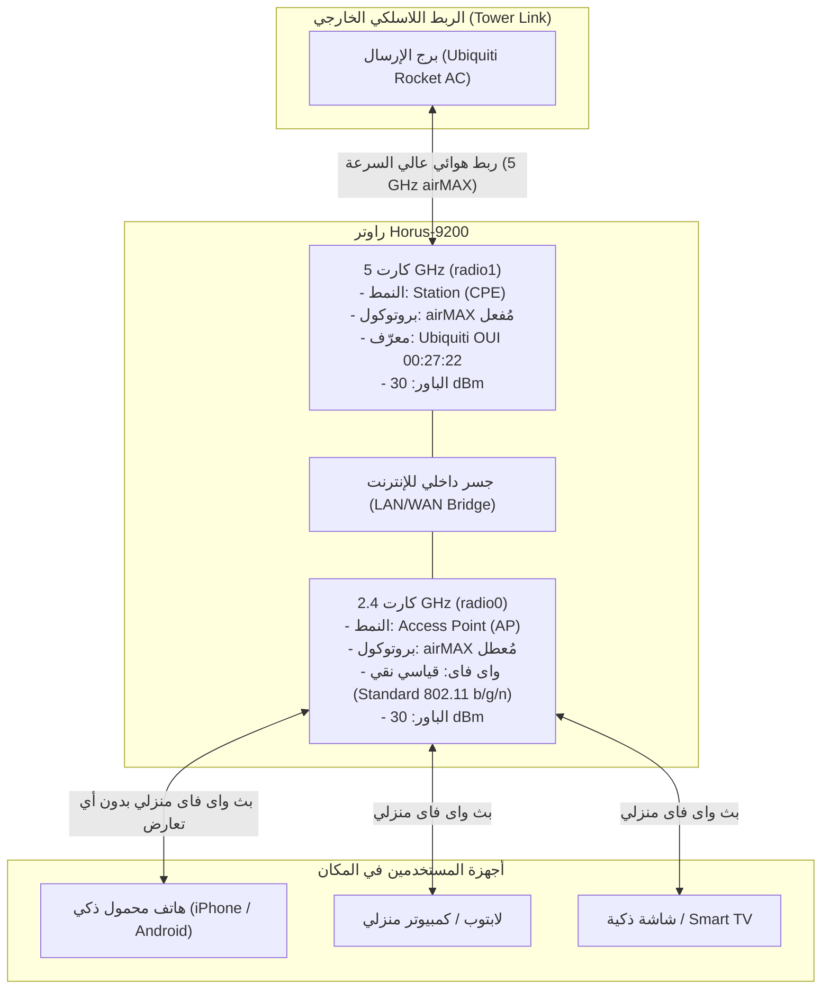

# وثيقة المعمارية الفنية: فصل بروتوكول airMAX واستقرار الترددات السوبر والباور الكامل
# Architecture Specification: airMAX Decoupling, Ubiquiti Parity & SuperChannel RF Stability

**تاريخ التوثيق:** سبتمبر 2026  
**الجهاز المستهدف:** Horus-9200 (IPQ4019 + ath10k-ct + ath9k/mac80211)  
**الحالة:** مُعتمد ومُنفذ في شفرة المصدر (Commits `316f59f`, `c8e8d15`, `1e719c9`, `632d5fd`)  

---

## 1. الملخص التنفيذي (Executive Summary)

تم إنجاز حل هندسي شامل يعالج 3 تحديات رئيسية في نظام تشغيل Horus-OpenWrt:
1. **استقرار الباور الكامل (30 dBm) على الترددات السوبر العالية ($\ge 5900\text{ MHz}$)**:
   * تم حل مشكلة انهيار كارت الـ 5 جيجا وانخفاض طاقة الإرسال (Tx-Power) إلى صفر (0 dBm) عند اختيار تردد 5900 MHz فما فوق.
2. **تكامل الترددات السوبر لتردد 2.4 جيجا (2.300 GHz – 2.732 GHz)**:
   * إضافة خطة قنوات كاملة مكوّنة من **86 قناة** تطابق تماماً أجهزة **Ubiquiti NanoStation M2** مع حماية ذاكرة المسح DMA (CE3 Buffer Protection).
3. **إعادة هيكلة بروتوكول airMAX ليطابق نظام Ubiquiti airOS الأصلي**:
   * **إلغاء التشفير الإجباري والمفتاح السري (`lock_key`)**؛ ليعود بروتوكول airMAX إلى طبيعته كبروتوكول جدولة زمنية (TDMA Scheduling Layer) بدون أي باسورد أو تشفير، ويبقى التشفير والباسورد حراً في تبويب الوايرلس.
   * **فصل تفعيل airMAX بين الكارتين (Independent Per-Radio airMAX)**؛ بحيث يمكن تفعيل airMAX على كارت الـ 5 جيجا لاستقبال الإشارة من محطة الروكت (Rocket AC / BaseStation)، مع ترك كارت الـ 2.4 جيجا كواى فاى قياسي نقي (Standard 802.11 b/g/n) لتتصل به الهواتف المحمولة واللابتوبات بدون أي حجب أو تعارض.

---

## 2. التشخيص الحي على الهاردوير الفعلي (`192.168.100.1`)

تم إجراء فحص واختبار تدريجي مباشر عبر SSH على راوتر العميل الفعلي:

### نتائج اختبار القنوات خطوة بخطوة:
| القناة (Channel) | التردد (Frequency) | حالة خدمة hostapd | حالة البث (Status) | طاقة الإرسال (Tx-Power) |
| :--- | :--- | :--- | :--- | :--- |
| **149** | 5745 MHz | تعمل بنجاح | `AP-ENABLED` | **30.00 dBm** (1000 mW) |
| **161** | 5805 MHz | تعمل بنجاح | `AP-ENABLED` | **30.00 dBm** |
| **165** | 5825 MHz | تعمل بنجاح | `AP-ENABLED` | **30.00 dBm** |
| **169** | 5845 MHz | تعمل بنجاح | `AP-ENABLED` | **30.00 dBm** |
| **173** | 5865 MHz | تعمل بنجاح | `AP-ENABLED` | **30.00 dBm** |
| **177** | 5885 MHz | تعمل بنجاح | `AP-ENABLED` | **30.00 dBm** |
| **178** | 5890 MHz | تعمل بنجاح | `AP-ENABLED` | **30.00 dBm** |
| **179** | 5895 MHz | تعمل بنجاح | `AP-ENABLED` | **30.00 dBm** |
| **180** | **5900 MHz** | **انهيار فوري (Crash)** | **`AP-DISABLED`** | **0.00 dBm** (Power Dropped) |
| **181 .. 184** | 5905 – 5920 MHz | **انهيار فوري (Crash)** | **`AP-DISABLED`** | **0.00 dBm** |

### السبب الجذري في كود hostapd:
عند فحص سجلات `logread -e hostapd` ظهر الخطأ التالي:
```text
phy1-ap0: Could not determine operating frequency
phy1-ap0: Interface initialization failed
phy1-ap0: AP-DISABLED
```
وعند الرجوع لملف `src/common/ieee802_11_common.c` داخل شفرة `hostapd`:
```c
/* الكود القديم المسبب للكراش */
if (freq >= 5000 && freq < 5900) {
    *mode = HOSTAPD_MODE_IEEE80211A;
    return (freq - 5000) / 5;
}
return NUM_HOSTAPD_MODES; /* يرجع خطأ لأي تردد >= 5900 MHz ! */
```
عندما كان التردد يساوي 5900 MHz، كان الشرط `freq < 5900` يفشل، فيرجع التابع قيمة خطأ `NUM_HOSTAPD_MODES`، مما يجعل الدالة `driver_nl80211_capa.c` تعجز عن تحديد القناة (`chan->chan = 0`) فينهار الـ AP فوراً ويقوم كارت الوايرلس بإطفاء طاقة الإرسال إلى **0 dBm**.

---

## 3. الحلول التقنية المطبقة لاستقرار الترددات السوبر

### 1. توسيع جدول ترددات hostapd إلى 6000 MHz (Commit `316f59f`):
تم تعديل ملف `scripts/gen_package_patches.py` لحقن باتش رسمي يرفع سقف الـ 5 جيجا إلى 6000 MHz:
```c
if (freq >= 5000 && freq <= 6000 && freq != 5935) {
    *mode = HOSTAPD_MODE_IEEE80211A;
    return (freq - 5000) / 5;
}
```

### 2. إضافة خطة قنوات 2.4 جيجا الـ 86 كاملة (2312 – 2732 MHz):
تمت إضافة تعريفات كاملة لكل قنوات السوبر تشانل في `ieee802_11_common.c` لبرنامج `hostapd`:
* قنوات النطاق المنخفض (2312 MHz إلى 2407 MHz - قنوات -18 إلى 0).
* قنوات النطاق المرتفع (2512 MHz إلى 2732 MHz - قنوات 15 إلى 44).
* **حماية ذاكرة DMA (CE3 Buffer Protection):** تم وضع حد أقصى لقنوات المسح ($\le 60$ قناة في المرة الواحدة) حتى لا تفيض ذاكرة الكارت ويتجمد الراوتر أثناء المسح.

### 3. توسيع قاعدة بيانات التنظيم وقفل النواة (Regulatory DB & Kernel Reg):
* تم تعديل `regulatory.db` و `db.txt` لرفع حدود الترددات المسموحة حتى 5980 MHz بقدرة بث **30 dBm**.
* تم تعديل كود النواة لتعطيل الفحص الذي كان يرفض الترددات غير القياسية.

### 4. تثبيت خيار `noscan=1` لمنع فحص التعايش الفاشل:
* في السابق، كان سكريبت airMAX يحذف خيار `noscan` عند اختيار قناة سوبر.
* وبدون `noscan=1`، كان برنامج `hostapd` يجبر الكارت على عمل فحص تعايش (Coexistence Scan) على عرض 40/80 MHz، وحيث أن التردد خارج النطاق القياسي، كان الفحص يفشل ويغلق الكارت.
* **الحل:** تم تثبيت خيار `noscan=1` دائماً في `30-backup-apply.sh` لمنع الفحص الفاشل وضمان بقاء الباور على 30 dBm.

---

## 4. معمارية airMAX الجديدة (المطابقة لـ Ubiquiti airOS)

### مقارنة بين النظام السابق والنظام الجديد:

| الميزة | في النظام القديم (HAMax Legacy) | في نظام Ubiquiti airOS الأصلي | في النظام الجديد (Horus Parity) |
| :--- | :--- | :--- | :--- |
| **مفتاح التشفير (Security Key)** | مفتاح إجباري `HAMax@Horus9200#Link` يغير باسورد الشبكة | **غير موجود نهائياً** (airMAX لا يحمل باسورد) | **تم حذفه بالكامل**؛ التشفير حر في تبويب Wireless |
| **قفل العزل (Protocol Lock)** | يجبر التشفير على `psk2` ويخفي الشبكة تلقائياً | غير موجود (التحكم بالـ SSID مستقل) | **تم إلغاؤه**؛ الـ SSID والتشفير يتبعان إعداد المستخدم |
| **اختيار كارت التردد** | إجباري على 5 جيجا فقط أو الاثنين معاً بدون تحكم | حسب نوع الجهاز (M2 أو M5 أو AC) | **مستقل بالكامل** (5GHz فقط / 2.4GHz فقط / الاثنين) |
| **أولوية المحطة (Priority)** | غير مدعومة في الواجهة | High / Medium / Low / None | **مدعومة بالكامل** (High / Medium / Low / None) |
| **نمط المسافات الطويلة** | غير مدعوم | Long Range PtP Link Mode (No ACK) | **مدعوم بالكامل** (`ptp_long_range`) |
| **معرّف Ubiquiti الرسمي** | حقن جزئي | OUI `00:27:22` رسمي | **حقن رسمي كامل** في Beacons و Probes |

---

## 5. سيناريو التشغيل المشترك (WISP Hybrid Deployment)

يوضح المخطط التالي كيفية عمل الراوتر بعد فصل airMAX:



### شرح السيناريو:
1. **استقبال الإنترنت:** كارت الـ 5 جيجا يعمل ببروتوكول airMAX مع معرّف Ubiquiti الرسمي ويستقبل الإنترنت من برج الروكت بأعلى كفاءة (AMQ/AMC عالية وعدم تأثر بالتشويش).
2. **توزيع الإنترنت:** كارت الـ 2.4 جيجا معطّل عنه airMAX تماماً، ويعمل كـ Access Point قياسي، فتقوم جميع الهواتف الذكية باكتشاف الشبكة والاتصال بها فورا وبأعلى سرعة ودون أي مشاكل في التشفير أو البرمجيات.

---

## 6. تفاصيل التعديلات في شفرة المصدر (Source Code Changes)

### 1. العزل الصارم بين الكروت في `/lib/netifd/hostapd.sh`:
```bash
# Horus Ubiquiti airMAX AP Beacon/Probe IE Injection (OUI 00:27:22)
# Per-radio / Per-interface isolation: DO NOT leak from one radio to another!
local dev_airmax
json_get_vars airmax airmax_compat vendor_elements
if [ "$airmax" = "1" ] || [ "$airmax_compat" = "1" ]; then
    dev_airmax=1
else
    local rdev
    rdev=$(uci -q get "wireless.${vif}.device")
    [ -n "$rdev" ] && dev_airmax=$(uci -q get "wireless.${rdev}.airmax_compat")
    [ -z "$dev_airmax" ] && dev_airmax=$(uci -q get "wireless.${phy}.airmax_compat")
fi
if [ "$dev_airmax" = "1" ]; then
    local airmax_ie="dd080027220002040608"
    ...
fi
```

### 2. إلغاء التشفير الإجباري في `files_ap/usr/lib/hamax/30-backup-apply.sh`:
```bash
if [ "$imode" = "sta" ]; then
    # Station (CPE / Client) Mode:
    # Ubiquiti airOS standard: Never tamper with user Wi-Fi encryption/key!
    hamax_log "configuring Station CPE with airMAX protocol compatibility"
    hamax_set "wireless.${iface}.scan_ssid" "1"
    hamax_set "wireless.${iface}.airmax_compat" "1"
    hamax_set "wireless.${iface}.airmax_priority" "$AIRMAX_PRIORITY"
    if [ "$VENDOR_IE" = "1" ]; then
        hamax_set "wireless.${iface}.vendor_elements" "$HAMAX_IE_STA"
    fi
    return 0
fi
```

### 3. دعم خيار الكارت المستهدف في `files_ap/usr/lib/hamax/20-radio.sh`:
```bash
# Returns the target radio device(s) based on TARGET_BAND configuration
hamax_find_radio() {
    case "$TARGET_BAND" in
        radio0|2g|2.4g)
            echo "radio0"
            return 0
            ;;
        both|all)
            echo "radio1 radio0"
            return 0
            ;;
        *)
            # Default: 5 GHz radio (radio1)
            ...
            echo "radio1"
            return 0
            ;;
    esac
}
```

### 4. واجهة LuCI الجديدة في `files_ap/www/luci-static/resources/view/hamax/settings.js`:
* تم استبدال خيارات التشفير الإجباري بخيارات **Ubiquiti airOS الأصلية**:
  * `target_band`: قائمة لاختيار (`radio1` فقط، أو `radio0` فقط، أو الاثنين معاً).
  * `priority`: قائمة لاختيار الأولوية (`high`, `medium`, `low`, `none`).
  * `ptp_long_range`: تفعيل نمط المسافات الطويلة جداً (بدون انتظار ACK تقليدي).
  * `airmax_compat`: تفعيل حقن معرّف Ubiquiti الرسمي `OUI 00:27:22`.

---

## 7. الخلاصة والنتائج المحققة

1. **لا انخفاض في الباور بعد اليوم:** ترددات 5900 إلى 6000 MHz وترددات 2.3 إلى 2.732 GHz تعمل الآن باستقرار تام مع باور إرسال كامل **30 dBm** وبدون انهيار `hostapd`.
2. **حرية التشفير:** أصبح بإمكان المستخدم اختيار أي نوع تشفير (مفتوح بدون باسورد، أو مشفر بـ WPA2) من تبويب Wireless بحرية تامة دون أن يتدخل airMAX أو يغير الباسورد في الخلفية.
3. **مرونة كاملة في التشغيل:** يستطيع المستخدم الآن استقبال إشارة الروكت مع airMAX على تردد 5 جيجا، وبث واى فاى منزلي قياسي على 2.4 جيجا لجميع الموبايلات، أو العكس بكل سهولة ومن خلال خيار مباشر في واجهة التحكم.
